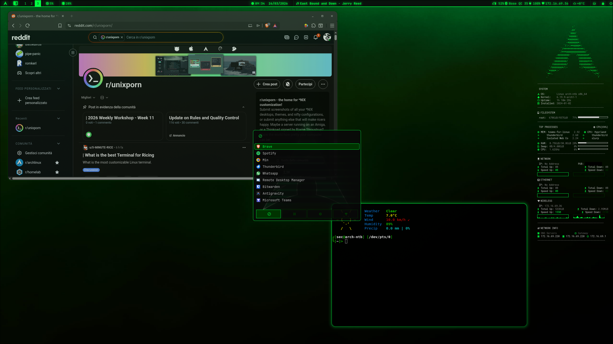
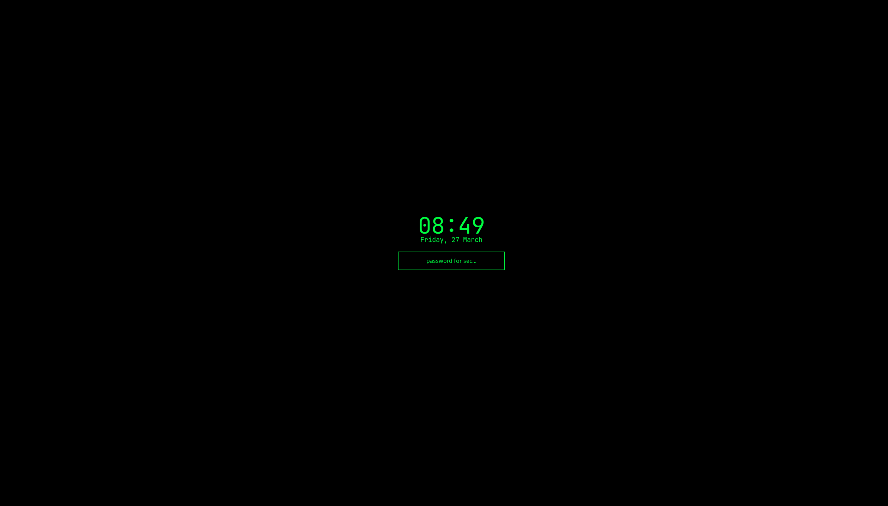

# 💻 green-hyprtheme - Hyprland Config

A **Dark Minimal** theme for Hyprland. Deep black, neon green, and an essential aesthetic.





## ✨ Features

- 🎨 **Minimal Theme**: Black (#0a0a0a) + Terminal Green (#00ff41)
- ⚡ **Lightweight and minimal**: Only the essentials, perfect for performance
- 🔒 **Integrated lock screen**: Hyprlock with coordinated style
- 📱 **Login screen**: Greetd with Tuigreet (green/black style)
- 🎯 **Configured Waybar**: Status bar with weather, media player, AI, and widgets
- 🚀 **Rofi**: Application launcher + WiFi menu, controls, subnet calculator, AI commands
- 🤖 **Local AI**: Ollama integrated for command generation and network calculations
- ⌨️ **Keybindings**: Intuitive shortcuts, Vim-style and multimedia keys
- 🔊 **Full audio**: PipeWire + Pavucontrol + hardware controls
- 📶 **Network configured**: NetworkManager with WiFi menu via Rofi

---

## 🚀 Installation

### Automatic (recommended)

Clone the repo and run the installer:

```bash
git clone https://github.com/privatefound/my-dotfiles.git ~/green-hyprtheme
cd ~/green-hyprtheme
./install.sh
```

The script will:
- Back up any existing `~/.config/hypr/` config
- Create a symlink `~/.config/hypr → <repo>` (or copy with `--copy`)
- Set executable permissions on all scripts
- Interactively configure Ollama, greetd, NetworkManager, and Bluetooth

### Manual

For full control over each step, follow the detailed guide:
👉 **[INSTALLATION.md](./INSTALLATION.md)**

---

## 📂 Folder Structure

```text
~/.config/hypr/
├── install.sh                  # 🚀 Automatic installer
├── INSTALLATION.md             # 🛠️ Manual installation guide
├── README.md                   # 📖 This documentation
├── README-THEME.md             # 🎨 Login/Lock screen details
├── hyprland.conf               # ⚙️ Core configuration
├── variables.conf              # 📋 Variables and apps (terminal, browser, editor...)
├── look.conf                   # 💅 Aesthetics and animations
├── keybindings.conf            # ⌨️ Keyboard shortcuts
├── monitors.conf               # 🖥️ Monitors and resolutions
├── autostart.conf              # ⏯️ Programs at startup
├── windows.conf                # 🪟 Window rules
├── workspaces.conf             # 🗂️ Workspace configuration
├── permissions.conf            # 🔐 Hyprland permissions
├── hypridle.conf               # 💤 Power management (dim/lock/suspend)
├── hyprlock.conf               # 🔒 Lock screen
├── waybar/                     # 📊 Status bar
│   ├── config                  #    Modules and layout
│   ├── style.css               #    CSS style
│   └── scripts/
│       ├── waybar-helper.sh    #    Weather (wttr.in) and connection status
│       ├── waybar-network-ip.sh #   Network IP display
│       └── waybar-notifications.sh # Notification count for swaync
├── rofi/                       # 🚀 Launcher and menus
│   ├── config.rasi             #    Main config
│   ├── theme.rasi              #    Graphical theme
│   └── scripts/
│       ├── rofi-wifi.sh        #    WiFi menu with nmcli
│       ├── rofi-control.sh     #    Volume, brightness, power menu, app install
│       ├── rofi-ai-cmd.sh      #    Generate Linux commands via Ollama AI
│       └── rofi-subnet.sh      #    IPv4 subnet calculator (ipcalc / Ollama)
├── swaync/                     # 🔔 Notifications
│   ├── config.json             #    Panel configuration
│   └── style.css               #    CSS style
├── conky/                      # 📟 System monitor overlay
│   ├── cyberconky.conf         #    Cyber theme config
│   └── fonts/                  #    Dedicated fonts (Roboto Mono Nerd Font)
├── wallpaper/                  # 🎨 Theme wallpapers
└── systemd/                    # 🛠️ Custom systemd services
```

---

## ⌨️ Main Keybindings

| Key | Action |
| :--- | :--- |
| `` ` `` (Backtick) | Open App Launcher (Rofi) |
| `Super + T` | Open Terminal (Kitty) |
| `Super + E` | Open File Manager (Nemo) |
| `Super + Shift + B` | Open Browser (Brave) |
| `Super + Shift + C` | Open Editor (Sublime Text) |
| `Super + K` | Close Window |
| `Super + X` | Shutdown menu / Exit Hyprland |
| `Super + V` | Floating Mode |
| `Super + F` | Fullscreen |
| `Super + Ctrl + L` | Lock Screen (Hyprlock) |
| `Super + S` | Scratchpad (hidden workspace) |
| `F1` | Area screenshot (grim + slurp + swappy) |
| `XF86AudioRaiseVolume` | Volume Up |
| `XF86AudioLowerVolume` | Volume Down |
| `XF86AudioMute` | Mute Audio |
| `XF86MonBrightnessUp/Down` | Brightness Up/Down |
| `XF86AudioNext/Prev/Play` | Media controls (playerctl) |
| `Alt + Tab` | Next window |

*See `keybindings.conf` for the full list.*

---

## 🤖 Local AI (Ollama)

Two Rofi scripts use **Ollama** with the `gemma3:1b` model:

- **`rofi-ai-cmd.sh`**: Describe a task in Italian/English and get the corresponding Linux command, with the option to copy it or run it in the terminal.
- **`rofi-subnet.sh`**: Calculate IPv4 subnet info. Uses `ipcalc` if installed, otherwise queries Ollama as a fallback.

To enable AI: `systemctl enable --now ollama && ollama pull gemma3:1b`

---

## 🛠️ Maintenance

If you encounter network issues, the system includes a pre-configured service at `systemd/NetworkManager-fixed.service` to handle startup timeouts on some Arch configurations.

> All paths in the configuration files use `$HOME` or `~` and are portable across any user without modifications.
